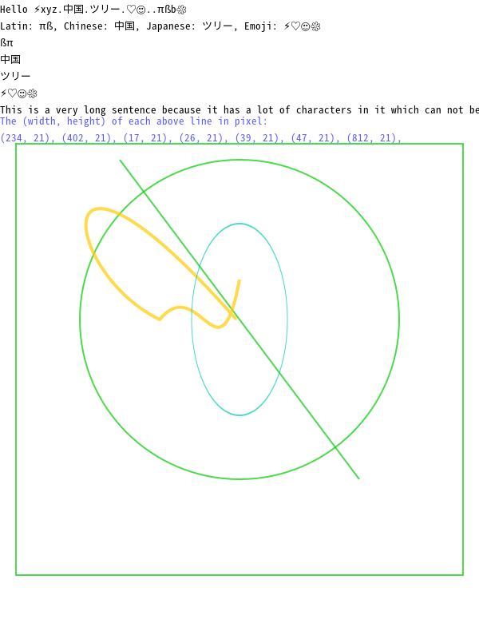
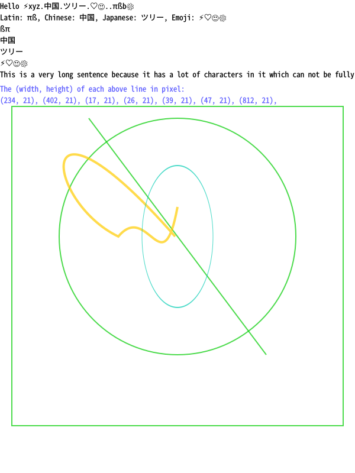

# Learning to use cairomm and pangomm in Linux docker container

This contains some C++ example programs that use cairomm and pangomm to render shapes and unicode text into images and PDF, and measure the pixel size of unicode text. These programs run in a Linux docker container.

## What does the examples do?

1. Cairomm examples can render circle, line, and reactagle into png and svg, and PDF.
2. Pangomm examples can render unicode text like Latin letters, Chinese, Japanese, Emoji, and measure pixel size of unicode text.

## Build and run

### Mac

#### Use VS Code to build and debug C++ program in docker

##### Prerequisites

- [Docker](https://docs.docker.com/get-docker/)
- [Visual Studio Code](https://code.visualstudio.com/)

- [VS Code Extension: Remote - Containers](https://marketplace.visualstudio.com/items?itemName=ms-vscode-remote.remote-containers), for connecting with a docker container
- [VS Code Extension: C/C++](https://marketplace.visualstudio.com/items?itemName=ms-vscode.cpptools), for editing and debugging C++ code

##### Build and debug C++ program in docker

1. In VS Code, go to "View > Command Palette...", enter "Remote-Containers: OpenFolder in Container..." and execute the command.
2. Navigate to the folder of this repository in your local disk, and open it.
3. Now wait for VS Code to finish building the docker image, it will take a while. (Note if VS Code asks about how to build the docker image, just choose to use the Dockerfile.)
4. Go to "View > Extentions" to install the "C/C++" extention in the docker container by clicking the "Install in Dev Container: Existing Dockerfile" button. We must reload VS Code after installing this extention, we can just click the "Reload Required" button.
5. Go to "View > Terminal" to open the Terminal, and use the commands from section "[Build and run C++ examples in docker](https://github.com/zhanglin-wu/image-lib-on-docker-poc#build-and-run-c-examples-in-docker)" to build the program.
6. Go to "View > Run" to open the debugger, select "measure-text-pdf", and then launch the program to start debugging.

#### Optional: Use Terminal to build and run C++ program in docker

##### Build and run docker image

Run the Dockerfile to build the docker image so that we can compile and run the C++ example programs in it:

```
docker build --tag cairomm-pangomm-on-linux-docker:1.0 .

docker run -it --rm --name renderer-test -v /path/to/your-local-source-root:/path/to/your-work-directory-in-docker-container cairomm-pangomm-on-linux-docker:1.0 /bin/bash
```

Here is an example command to run the image in docker:

```
docker run -it --rm --name renderer-test -v /users/<user>/repositories/cairomm-pangomm-on-linux-docker:/workspaces/cairomm-pangomm-on-linux-docker cairomm-pangomm-on-linux-docker:1.0 /bin/bash
```

##### Build and run C++ examples in docker container

```
cd /workspaces/cairomm-pangomm-on-linux-docker/examples/pangomm
mkdir -p build && cd build

g++ -g -Wall -o measure-text-pixel-size-pdf `pkg-config --cflags cairomm-1.0 pangomm-1.4` ../measure-text-pixel-size-pdf.cpp `pkg-config --libs cairomm-1.0 pangomm-1.4`

./measure-text-pixel-size-pdf "../unicode-text.txt" "Noto Sans Mono CJK TC"
```

##### Optional: Install third party libraries on Mac for source navigation

This is just for improving developers' productivity on Mac writing C++ code in VS Code.

Install the dependencies using brew so that we can navigate through the source code of the third party libraries.

```
brew install pangomm
brew install pkgconfig
```

## Techincal Limitations

1. Drawing ellipse with cairo
   - Cairo doesn't support ellipse natively, we have to use a circle to model a ellipse by scalling differently between horizonal and vertical directions. But the problem is that the line width of the ellipse becomes different on horizonal and vertical directions.
2. Drawing an embeded image
   - Not sure how we can draw an embeded image, need to more research.


## Questions

### Fonts

1. Which fonts should we install by default?
2. There are too many fonts installed for the examples here, how do we remove the unuseful ones?

## References

- [Cairomm: A C++ wrapper for the cairo graphics library](https://www.cairographics.org/documentation/cairomm/reference/index.html)
- [Pangomm: The official C++ interface for the Pango font layout library](https://developer.gnome.org/pangomm/2.42/)
- [Docker: Build and run your image](https://docs.docker.com/get-started/part2/)
- [VS Code: Developing inside a Container](https://code.visualstudio.com/docs/remote/containers)
- [VS Code: Example of debugging C++ code in docker containers](https://github.com/microsoft/vscode-remote-try-cpp)

## Gallery

**Unicode texts and their pixel sizes, and some shapes**

PNG



SVG



PDF

[measure-text-pixel-size-pdf.pdf](README-resources/measure-text-pixel-size-pdf.pdf) 
